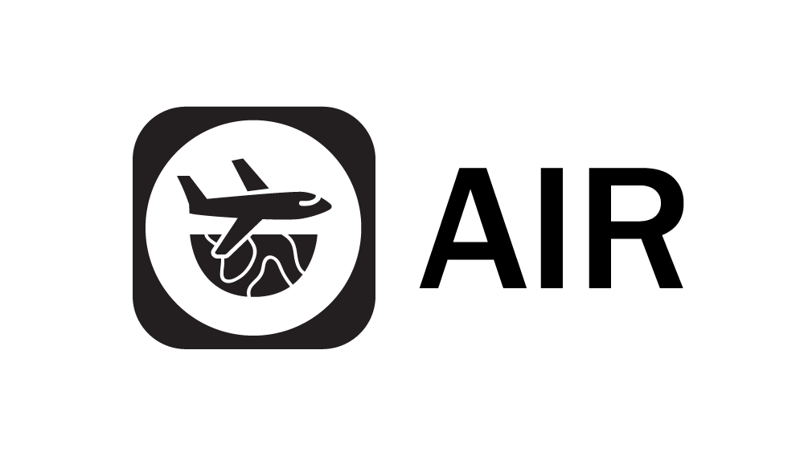
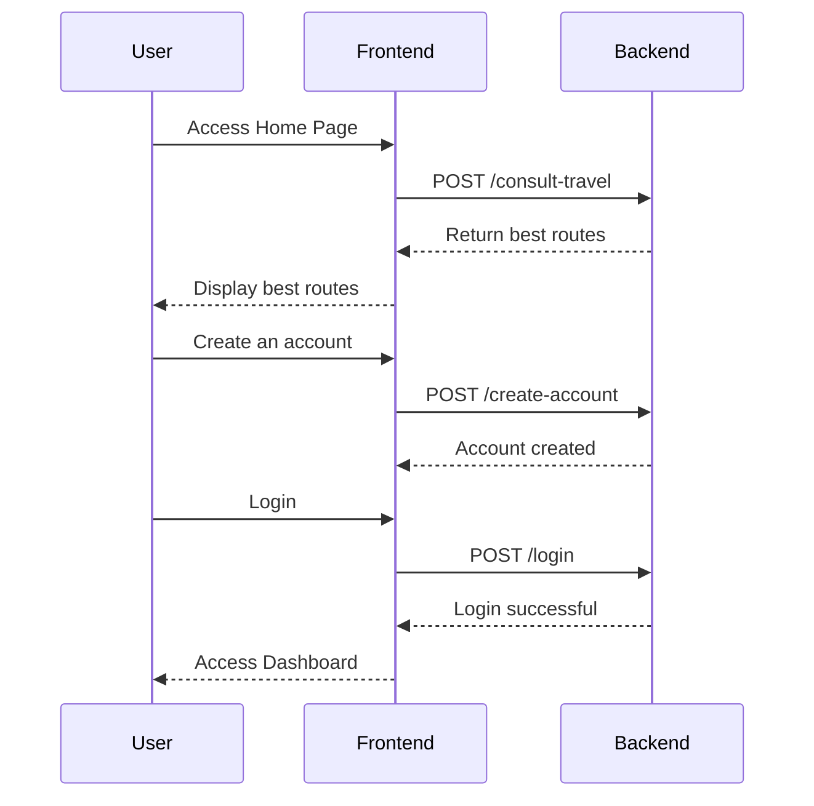
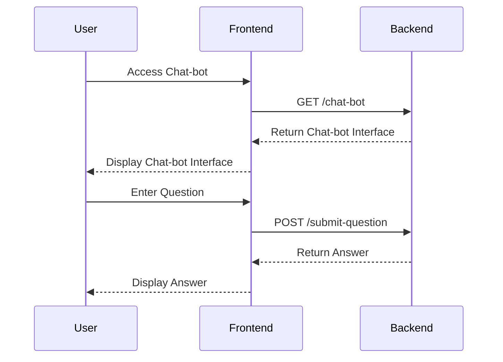

    

Procurando uma viagem econômica e divertida? Voe conosco!

# Overview

A AIR, abreviação para Airline Information Resource (Recurso de informações de companhias aéreas), é muito mais do que apenas mais uma plataforma de reservas de voos. Fundada com a visão de simplificar e aprimorar o planejamento de viagens aéreas para todos os tipos de viajantes, a AIR representa uma abordagem inovadora para a reserva de voos, prezando pela experiência do usuário.

    
<ul>
    <li>Transformação da Experiência de Reserva de Voos: O projeto da AIR está revolucionando a forma como as pessoas reservam voos, oferecendo uma plataforma centrada no usuário e focada na personalização. Ao utilizar tecnologias avançadas, como web scraping e inteligência artificial, estamos proporcionando aos usuários uma experiência de reserva de voos mais intuitiva e eficiente.</li>

<li>Acessibilidade e Personalização: A AIR está comprometida em tornar a reserva de voos acessível a todos os viajantes, independentemente de seu orçamento ou preferências de viagem. Ao oferecer recomendações de voos altamente personalizadas e uma ampla gama de recursos exclusivos, estamos tornando o processo de reserva de voos mais conveniente e satisfatório para todos os usuários.</li>

<li>Inovação e Qualidade de Serviço: Nossa plataforma se destaca pela inovação e excelência em tudo o que fazemos. Com uma equipe dedicada e uma paixão por viagens, estamos constantemente buscando formas de melhorar e aprimorar a experiência do usuário, oferecendo um serviço de alta qualidade e mantendo os mais altos padrões de conduta em todas as nossas operações.</li>
</ul>

# Objetivo

O objetivo central do AIR é transformar o processo de reserva de voos em uma experiência acessível, personalizada e altamente satisfatória para os usuários. A missão da plataforma vai além de simplesmente oferecer uma lista de opções de voos; ela se propõe a simplificar toda a jornada do usuário, desde a pesquisa inicial até a finalização da reserva, proporcionando uma experiência completa e centrada no usuário.

# Diagrama com a rota de Cadastro e Login do Usuário

# Diagrama ilustrando a interação com o ChatBot

